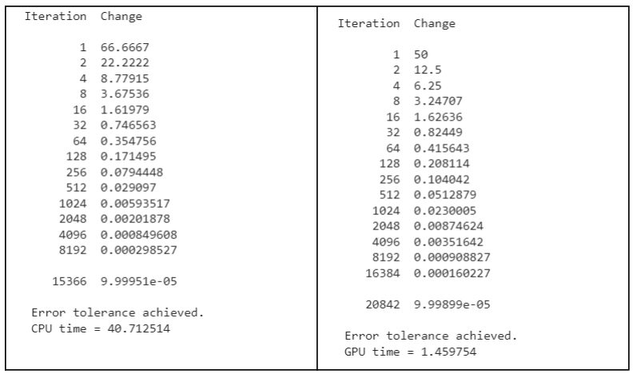
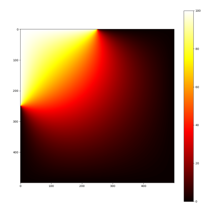

Hi, this is code for solve Laplace Equation by Gauss-Seidel Iterative

### Running

```
%%bash
nvcc main.cu
./a.out 0.0001 "result.txt"
```

### Visualize 
```
python draw_heat_map.py
````

### Experiments
#### Results on CPU and GPU 
<p align="center">

</p>

#### Heat map 
<p align="center">

</p>
